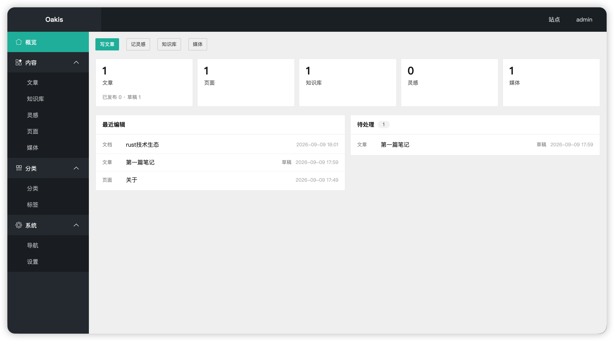

<div align="center">

# Oakis

[](https://github.com/lxien/oakis/releases)
[](https://github.com/lxien/oakis/releases)
[](LICENSE)
[](https://www.rust-lang.org)
[](https://github.com/lxien/oakis/releases)
[](https://www.sqlite.org)
[](https://github.com/lxien/oakis/stargazers)
[](https://github.com/lxien/oakis/forks)
[](https://github.com/lxien/oakis/issues)

</div>



**Oakis** 是一个轻量级的跨平台 **CMS**

## 快速开始

从 [Releases](https://github.com/lxien/oakis/releases) 下载对应平台压缩包，解压后运行:

```bash
./oakis
```

浏览器打开 `http://127.0.0.1:8080`

可在可执行文件同目录新建 `.env`自定义配置：

```properties
OAKIS_HOST=0.0.0.0
OAKIS_PORT=8080
OAKIS_DATA_DIR=data
OAKIS_LOGIN_PATH=/login
RUST_LOG=oakis=info,tower_http=info
```

| 环境变量                    | 默认                                  | 说明                |
|-----------------------------|---------------------------------------|---------------------|
| `OAKIS_HOST` / `OAKIS_PORT` | `0.0.0.0` / `8080`                    | 监听地址和端口      |
| `OAKIS_DATA_DIR`            | `data`                                | 数据目录            |
| `OAKIS_DATABASE_URL`        | `sqlite:{data_dir}/oakis.db?mode=rwc` | 数据库连接          |
| `OAKIS_UPLOAD_DIR`          | `{data_dir}/uploads`                  | 上传文件目录        |
| `OAKIS_LOGIN_PATH`          | `/login`                              | 后台登录路径        |
| `OAKIS_SESSION_SECURE`      | `false`                               | Cookie 是否仅 HTTPS |
| `RUST_LOG`                  | `oakis=info,tower_http=info`          | 日志级别            |

### Docker

```bash
docker run -d --name oakis \
  -p 8080:8080 \
  -v oakis-data:/data \
  ghcr.io/lxien/oakis:latest
```

浏览器打开 `http://127.0.0.1:8080`

## 开机自启（Linux / macOS）

### 1. 准备

```bash
mkdir -p ~/oakis
chmod +x ~/oakis/oakis
```

```bash
cat > ~/oakis/.env <<'EOF'
OAKIS_HOST=0.0.0.0
OAKIS_PORT=8080
OAKIS_DATA_DIR=data
OAKIS_LOGIN_PATH=/login
RUST_LOG=oakis=info,tower_http=info
EOF
```

先验证是否可以正常运行

```shell
cd ~/oakis && ./oakis
```

浏览器打开 `http://127.0.0.1:8080`，确认后 `Ctrl+C`

### 2. Linux（systemd）

```bash
mkdir -p ~/.config/systemd/user
cat > ~/.config/systemd/user/oakis.service <<EOF
[Unit]
Description=Oakis
After=network.target

[Service]
WorkingDirectory=$HOME/oakis
ExecStart=$HOME/oakis/oakis
Restart=on-failure

[Install]
WantedBy=default.target
EOF

systemctl --user daemon-reload
systemctl --user enable --now oakis
```

管理：`systemctl --user status|restart|stop oakis`

未登录也开机启动：`loginctl enable-linger $USER`

### 3. macOS（launchd）

```bash
cat > ~/Library/LaunchAgents/com.oakis.app.plist <<EOF
<?xml version="1.0" encoding="UTF-8"?>
<!DOCTYPE plist PUBLIC "-//Apple//DTD PLIST 1.0//EN" "http://www.apple.com/DTDs/PropertyList-1.0.dtd">
<plist version="1.0">
<dict>
  <key>Label</key><string>com.oakis.app</string>
  <key>ProgramArguments</key>
  <array><string>$HOME/oakis/oakis</string></array>
  <key>WorkingDirectory</key><string>$HOME/oakis</string>
  <key>RunAtLoad</key><true/>
  <key>KeepAlive</key><true/>
</dict>
</plist>
EOF

launchctl bootstrap gui/$(id -u) ~/Library/LaunchAgents/com.oakis.app.plist
```

状态：`launchctl print gui/$(id -u)/com.oakis.app`

卸载：

```bash
launchctl bootout gui/$(id -u)/com.oakis.app
rm ~/Library/LaunchAgents/com.oakis.app.plist
```

## 自行构建

```bash
cargo build --release
```

产物：`./target/release/oakis`

## 开源协议

[MIT](https://github.com/lxien/oakis/blob/main/LICENSE)
